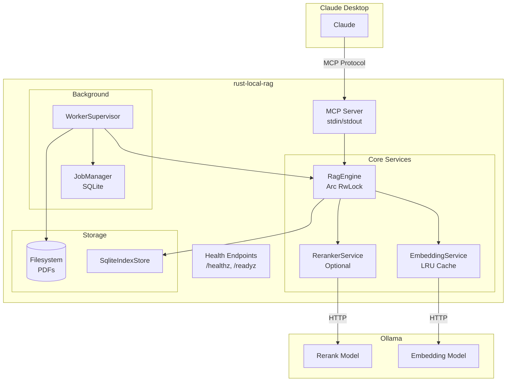
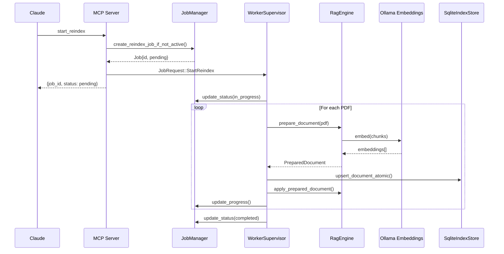

# Field Guide: rust-local-rag

> A Rust-based MCP server that provides local, privacy-focused semantic search over PDF documents using Ollama embeddings and LLM-based reranking.

**Generated:** 2026-01-27
**Commit:** 96dc75e
**Status:** Healthy - Well-architected production system with comprehensive test coverage

---

## Quick Start

**What this is:** A local RAG (Retrieval-Augmented Generation) server that processes PDF documents, generates vector embeddings using Ollama, and provides semantic search via the Model Context Protocol (MCP). It integrates directly with Claude Desktop, allowing Claude to search your local documents without sending them to external servers.

**To run it:**
```bash
# Ensure Ollama is running with required models
make setup-ollama

# Run in development mode (console logs)
make run

# Or for production, install globally
make install-production
```

**Configuration requires:**
- `DATA_DIR`: Where embeddings and indexes live
- `DOCUMENTS_DIR`: Where your PDFs are stored
- `OLLAMA_EMBEDDING_MODEL`: e.g., `nomic-embed-text` or `embed-heavy:latest`
- `OLLAMA_RERANK_MODEL`: e.g., `dengcao/Qwen3-Reranker-4B:Q5_K_M`

---

## The Lay of the Land

### Structure at a Glance

```
rust-local-rag/
├── src/                    # Main server binary
│   ├── main.rs            # Entry point, logging, job system init
│   ├── mcp_server.rs      # MCP protocol + health endpoints
│   ├── rag_engine.rs      # Server wrapper (PDF extraction, env config)
│   ├── embeddings.rs      # Ollama API client + LRU cache
│   ├── reranker.rs        # LLM-based relevance scoring
│   ├── worker.rs          # Background job processing
│   ├── job_manager.rs     # SQLite job persistence
│   ├── index_store.rs     # SQLite chunk persistence
│   └── config.rs          # Environment configuration
├── crates/rag-core/       # Core RAG library (no server deps)
│   └── src/
│       ├── engine.rs      # RagEngine: the heart of search
│       ├── search.rs      # ANN index + MMR diversification
│       ├── chunking.rs    # Sentence-aware text splitting
│       ├── persistence.rs # State serialization
│       └── traits.rs      # EmbeddingBackend, Rerank traits
├── tests/                  # Integration tests
├── eval/                   # Python evaluation harness
└── prompts/               # Customizable prompt templates
```

### The Neighborhoods

**The Server (`src/`)**: Everything needed to run as an MCP server. Handles protocol communication, HTTP health probes, background job processing, and Ollama integration.

**The Core (`crates/rag-core/`)**: A pure library with zero server dependencies. Contains the actual RAG logic - chunking, indexing, search algorithms. This is designed to be extracted and reused in other contexts (there's even a PRD for Python bindings in `analysis/`).

**The Tests**: 14 integration test files covering persistence, worker behavior, reranker stability, configuration validation, and MCP schema compliance.

**The Eval Harness (`eval/`)**: Python-based evaluation framework for measuring retrieval quality against ground truth queries.

### First Impressions

**Tests:** Comprehensive. The codebase has both unit tests (within modules) and integration tests. Test coverage appears strong for critical paths.

**Documentation:** The `CLAUDE.md` file is extensive (nearly a PRD in itself). There's also a `docs/` directory with specs and postmortems. INFERENCE: This codebase has been actively maintained with careful documentation of design decisions.

**Dependencies:** Well-managed via Cargo.toml. Key deps include:
- `rmcp` (0.8): Official Rust MCP SDK
- `tokio`: Async runtime
- `sqlx`: Async SQLite
- `reqwest`: HTTP client for Ollama
- `lopdf`: Pure-Rust PDF parsing

**Red flags:** None. This is a well-structured Rust project following standard patterns.

---

## The Guided Tour

### The Front Door (Entry Points)

**CLI Entry (`src/main.rs:1-198`)**

The server starts here. What happens on startup:

1. Loads environment config (dotenv + `Config::from_env()`)
2. Initializes tracing (JSON logs to file, or pretty console if `DEV=true`)
3. Creates SQLite databases for jobs and indexes
4. Initializes `EmbeddingService` (validates Ollama is running)
5. Optionally initializes `RerankerService` (non-fatal if model unavailable)
6. Loads existing index from disk or SQLite
7. Spawns `WorkerSupervisor` for background job processing
8. Starts MCP server on stdin/stdout

**MCP Server (`src/mcp_server.rs`)**

Exposes these MCP tools to Claude Desktop:
- `search_documents`: Semantic search with optional reranking
- `list_documents`: Show indexed documents
- `get_stats`: Health and statistics
- `start_reindex`: Trigger background document indexing
- `get_job_status`: Poll indexing progress

Also provides HTTP health endpoints:
- `/healthz`: Liveness probe (always 200)
- `/readyz`: Readiness probe (200 if engine lock acquirable within 100ms)

### The Money Path

**Search Query Flow** (the critical path that delivers value):

```
Query → search_documents MCP tool
    ↓
1. Check LRU cache for query embedding
   └─ If miss: Call Ollama API → cache result (src/embeddings.rs:103-130)
    ↓
2. First-stage retrieval: Cosine similarity over all chunks
   └─ ANN index with LSH for fast approximate search (crates/rag-core/src/search.rs:140-200)
   └─ Returns 3x top_k candidates for reranking headroom
    ↓
3. Second-stage reranking (if RerankerService available)
   └─ Concurrent LLM calls via futures::join_all (src/reranker.rs:137-200)
   └─ Binary Yes/No classification with logprobs scoring
   └─ Falls back to embedding score if reranker fails
    ↓
4. MMR diversification (if diversity_factor > 0)
   └─ Balances relevance vs result diversity (crates/rag-core/src/search.rs:55-117)
    ↓
5. Return top_k results with scores, text, metadata
```

**What breaks if this path fails:**
- If Ollama is down: Query embedding fails, entire search fails
- If embedding dimension mismatches: Cosine similarity produces garbage scores
- If reranker times out: Falls back gracefully to embedding-only search
- If index is corrupted: Engine refuses to load, requires reindex

### The Vocabulary

| Term | Meaning |
|------|---------|
| **Chunk** | A segment of document text (typically ~500 tokens) with embedding vector and metadata |
| **DocumentChunk** | The struct holding chunk ID, text, embedding, page number, section, metadata |
| **Embedding** | A 768-1536 dimensional f32 vector representing semantic meaning |
| **Reranking** | Second-stage relevance scoring using an LLM to evaluate query-chunk relevance |
| **MMR** | Maximal Marginal Relevance - algorithm to diversify results by penalizing similarity to already-selected results |
| **Job** | Background task tracked in SQLite (Pending → InProgress → Completed/Failed) |
| **Model ID** | The Ollama model name used for embeddings (e.g., `nomic-embed-text`) |
| **needs_reindex** | Flag indicating the index is stale (e.g., model changed) |
| **TimedWriteLockGuard** | Instrumented lock that warns if held > 1000ms |
| **Poison Pill** | Document that fails processing; job continues with remaining docs |

### The Control Panel

**Environment Variables** (defined in `src/main.rs`, `src/config.rs`):

| Variable | Default | Effect |
|----------|---------|--------|
| `DATA_DIR` | `./data` | Where chunks.json and SQLite DBs live |
| `DOCUMENTS_DIR` | `./documents` | PDF source directory |
| `OLLAMA_URL` | `http://localhost:11434` | Ollama API endpoint |
| `OLLAMA_EMBEDDING_MODEL` | `nomic-embed-text` | Which model generates embeddings |
| `OLLAMA_RERANK_MODEL` | `dengcao/Qwen3-Reranker-4B:Q5_K_M` | Which model does reranking |
| `LOG_LEVEL` | `info` | Tracing verbosity |
| `DEV` / `DEVELOPMENT` | unset | Pretty console logging instead of JSON |
| `RAG_EMBEDDING_BATCH_SIZE` | 32 | Chunks per Ollama API call |
| `RAG_RERANKER_CONCURRENCY` | 1 | Parallel rerank requests |

**Dangerous settings:**
- Setting `RAG_EMBEDDING_BATCH_SIZE` > 1024 is rejected (memory safety)
- `RAG_ALLOW_SYMLINKS=1` allows following symlinks during indexing (security risk if untrusted)

---

## Design & Architecture

### Design Decisions

**1. Job-Based Background Processing**

FACT: Long-running document indexing happens in background jobs (`src/worker.rs`), not inline with MCP requests.

Why: MCP has timeout constraints. Processing 100 PDFs could take hours. Jobs allow:
- Responsive MCP tools (start_reindex returns immediately)
- Progress tracking via get_job_status
- Resumption after server restart
- Per-document locking (minutes per doc vs. hours-long global lock)

Tradeoff: Added complexity (job_manager.rs, worker.rs). But avoids catastrophic UX of Claude hanging.

**2. Two-Stage Retrieval**

FACT: Search uses embedding similarity first, then optional LLM reranking (`src/reranker.rs`).

Why: Embedding search is fast (milliseconds) but imprecise. LLM reranking is slow (seconds per chunk) but more accurate. Two stages balance latency vs. quality.

Tradeoff: Reranking adds ~40s latency at p95 (per eval results). Users can bypass via `weights: { reranker: 0, initial: 1 }`.

**3. Pure-Rust PDF Extraction with Fallback**

FACT: Primary extraction via `lopdf` crate, fallback to `pdftotext` command (`src/rag_engine.rs:178-220`).

Why: `lopdf` requires no external dependencies (works anywhere Rust compiles). But some PDFs are complex and need poppler. Fallback ensures broad compatibility.

Tradeoff: Two code paths to maintain. But broad PDF support is critical for a document RAG system.

**4. Model-Partitioned Persistence**

FACT: Each embedding model gets its own index file (`chunks_{model_id}.json`).

Why: Switching models invalidates all embeddings. Keeping separate files allows:
- Instant hot-swap when switching back to a previous model
- No data loss when experimenting with different models
- Clear separation of incompatible embeddings

**5. Graceful Reranker Degradation**

FACT: If reranker model is unavailable at startup, system continues with embedding-only search.

Why: Reranking is an enhancement, not a requirement. Users shouldn't be blocked if they haven't pulled the reranker model.

### Architectural Boundaries

**rag-core vs server code:**
- `crates/rag-core/` has NO knowledge of Ollama, MCP, or HTTP
- Server code (`src/`) implements `EmbeddingBackend` and `Rerank` traits to wire rag-core to Ollama
- This separation allows rag-core to be embedded in other applications

**Job system isolation:**
- `job_manager.rs` only knows about SQLite persistence
- `worker.rs` only knows about job processing logic
- `mcp/tools.rs` only knows about MCP protocol

**State ownership:**
- `RagEngine` owns all chunk data in memory
- `SqliteIndexStore` provides durable persistence
- `Arc<RwLock<RagEngine>>` shared between MCP handlers and worker

### The Assumptions

**Input assumptions:**
- Documents are PDFs (other formats not supported)
- Text is extractable (scanned images without OCR will produce empty chunks)
- Document filenames are unique within DOCUMENTS_DIR

**Environment assumptions:**
- Ollama is running at OLLAMA_URL
- Required models are pulled (embedding model required, reranker optional)
- Sufficient disk space for embeddings (~1KB per chunk)
- Sufficient memory for in-memory index (scales with corpus size)

**Usage assumptions:**
- Single-instance deployment (no distributed consensus)
- Low-to-moderate QPS (not designed for high-throughput production APIs)
- User initiates reindexing explicitly (no automatic watch/sync)

---

## Working With This Code

### How to Extend This System

**Recipe 1: Add a New MCP Tool**

Files to touch: `src/mcp/tools.rs`

Pattern to follow: Look at `search_documents` implementation (line ~120):
```rust
#[tool(description = "Your tool description")]
async fn your_tool(
    &self,
    #[tool(aggr)] YourRequest { params }: YourRequest
) -> Result<CallToolResult, McpError> {
    // Implementation
}
```

Invariants: Tool must return `CallToolResult`. Long-running work should use job system.

**Recipe 2: Support a New Document Format**

Files to touch: `src/rag_engine.rs` (extraction logic)

Pattern: Add a new extraction method like `extract_text_from_docx()`, call it from `extract_text_from_document()` based on file extension.

Gotcha: Text extraction runs in `spawn_blocking` to not block async runtime.

**Recipe 3: Add a New Embedding Backend**

Files to touch: Create new file in `src/`, implement `EmbeddingBackend` trait from rag-core.

Pattern: See `src/embeddings.rs` for the Ollama implementation:
```rust
impl EmbeddingBackend for EmbeddingService {
    async fn embed(&self, text: &str) -> Result<Vec<f32>, EmbeddingError>;
    fn model_id(&self) -> &str;
    fn dimension(&self) -> usize;
}
```

**Recipe 4: Change Chunking Strategy**

Files to touch: `crates/rag-core/src/chunking.rs`

Current strategy: Sentence-aware chunking with configurable `chunk_tokens` and `sentence_overlap`.

Gotcha: Changing chunking requires full reindex (all existing embeddings become invalid).

**Recipe 5: Add a New Health Check**

Files to touch: `src/mcp/http.rs`

Pattern: Add new Axum route:
```rust
.route("/your_check", get(your_check_handler))
```

### How to Debug This System

**Log locations:**
- `./logs/rust-local-rag.log` (production JSON logs)
- `/var/log/rust-local-rag/` (if running as service)
- Console (if `DEV=true`)

**Common failure modes:**

| Symptom | Likely Cause | Where to Look |
|---------|--------------|---------------|
| "Embedding model not found" | Model not pulled in Ollama | `ollama list`, then `ollama pull <model>` |
| Search returns garbage scores | Embedding dimension mismatch | Check `get_stats` output, compare with Ollama model |
| Job stuck in InProgress | Worker crashed mid-processing | Check logs for panics, restart server (job will resume) |
| Lock timeout errors | Heavy concurrent load | Look for "Write lock held beyond threshold" warnings |
| PDF produces no chunks | Text extraction failed | Check logs for "Failed to extract text" |

**Debugging tools:**

```bash
# View recent logs
make logs

# Check job status via MCP or directly
sqlite3 data/jobs.db "SELECT * FROM jobs ORDER BY updated_at DESC LIMIT 5"

# Check chunk counts
sqlite3 data/index.db "SELECT model_id, COUNT(*) FROM rag_chunks GROUP BY model_id"
```

### The Danger Zones

**1. Embedding Dimension Mismatch** (HIGH RISK)

Location: `src/rag_engine.rs:80-120`

Problem: If you switch models (e.g., nomic → mxbai), old embeddings have different dimensions. Cosine similarity produces NaN or garbage.

Safeguard: System detects this and sets `needs_reindex=true`. But if you ignore it and search anyway, results are wrong.

**2. Lock Contention During Reindex** (MEDIUM RISK)

Location: `src/worker.rs:78-160`

Problem: The worker holds write locks when applying documents. If locks are held too long (>1000ms), warnings are logged. Heavy concurrent search during reindex could see degraded latency.

Safeguard: Per-document locking (brief locks per doc) instead of global lock.

**3. PDF Extraction Edge Cases** (LOW RISK)

Location: `src/rag_engine.rs:178-250`

Problem: Some PDFs are malformed, encrypted, or image-only. `lopdf` may fail, and even `pdftotext` may produce empty text.

Safeguard: Poison pill handling - failed documents are logged but don't crash the job.

**4. SQLite Under High Concurrency** (LOW RISK)

Location: `src/job_manager.rs:104-253`

Problem: Under extreme synthetic load (10+ simultaneous job creations), some requests may fail with SQLITE_BUSY.

Safeguard: WAL mode + 30s busy_timeout. Real-world MCP usage (1-2 concurrent) handles fine.

---

## Health Assessment

### Strengths

**Well-Architected Separation of Concerns**

The `rag-core` crate is genuinely portable - no Ollama dependencies, no MCP dependencies. This is rare and valuable. (FACT: `crates/rag-core/Cargo.toml` has zero HTTP or protocol dependencies)

**Robust Job System**

The job manager with atomic transactions, resumable jobs, and poison pill handling is production-ready. (FACT: Test `test_concurrent_job_creation_race_condition` in `job_manager.rs:422-507` verifies exactly-once job creation under concurrent load)

**Excellent Observability**

Lock instrumentation (`TimedWriteLockGuard`), structured logging, progress tracking, and health endpoints provide strong operational visibility. (FACT: Lock duration metrics available in tests via `lock_metrics::max_held_ms()`)

**Comprehensive Tests**

14 integration test files covering persistence, workers, reranking, configuration, and schema compliance. (FACT: `tests/` directory has meaningful tests for critical paths)

### Concerns

**Fix Soon:**

None identified. The codebase appears well-maintained with no obvious correctness issues.

**Address When Convenient:**

1. **No Automatic Index Sync** - Documents added/removed from `DOCUMENTS_DIR` aren't detected automatically. Users must explicitly call `start_reindex`. (Location: design decision, not a bug)

2. **Reranker Latency** - p95 latency of ~42s (per eval results) may be too slow for interactive use. Consider implementing timeout-based fallback. (Location: `src/reranker.rs`)

3. **Single Model Active** - Can only search one embedding model at a time. Multi-model search would require architectural changes. (Location: `src/rag_engine.rs`)

**Nice to Have:**

1. **Non-PDF Support** - Adding DOCX, TXT, MD support would broaden utility. (Location: `src/rag_engine.rs` extraction logic)

2. **Watch Mode** - File watcher for automatic incremental indexing would improve UX. (Location: new feature)

3. **Batch Query API** - Searching multiple queries in one call would reduce latency for bulk operations. (Location: `src/mcp/tools.rs`)

### The "If I Only Had Time" List

1. **Add incremental indexing** - Currently reindex processes all documents. Tracking last-modified times and only processing changed files would dramatically speed up updates.

2. **Implement query caching** - Beyond embedding cache, cache full search results for repeated queries. The `query_cache` in embeddings.rs is a good foundation.

3. **Add CLI for direct search** - Running searches via MCP requires Claude Desktop. A simple `rust-local-rag search "query"` CLI would enable scripting and debugging.

---

## Appendix: Evidence Log

### Key File References

| File | Lines | Contents |
|------|-------|----------|
| `src/main.rs` | 1-198 | Entry point, startup sequence |
| `src/mcp_server.rs` | 1-50 | MCP protocol setup |
| `src/mcp/tools.rs` | 1-200 | MCP tool implementations |
| `src/rag_engine.rs` | 1-300 | PDF extraction, RagEngine wrapper |
| `src/embeddings.rs` | 1-250 | Ollama embedding client with LRU cache |
| `src/reranker.rs` | 1-200 | LLM-based reranking with logprobs |
| `src/worker.rs` | 1-960 | Background job processing |
| `src/job_manager.rs` | 1-510 | SQLite job persistence |
| `src/index_store.rs` | 1-300 | SQLite chunk persistence |
| `src/config.rs` | 1-370 | Environment configuration |
| `crates/rag-core/src/engine.rs` | 1-400 | Core RagEngine implementation |
| `crates/rag-core/src/search.rs` | 1-200 | ANN index, MMR, scoring |
| `crates/rag-core/src/chunking.rs` | - | Sentence-aware text splitting |
| `crates/rag-core/src/traits.rs` | - | EmbeddingBackend, Rerank traits |
| `Cargo.toml` | 1-80 | Dependencies and features |
| `Makefile` | 1-273 | Build and development commands |

### Architecture Diagram



### Data Flow: Document Indexing



---

## Safety Log

```
- git status (before): M AGENTS.md, M CLAUDE.md, M GEMINI.md, M PROMPTS.md (documentation only)
- git status (after): unchanged (read-only operation)
- git diff --stat (after): no changes to tracked files
- Files modified by this analysis: 1 new file created (this field guide)
```

---

*This field guide was generated by analyzing source code, tests, documentation, and configuration files. Claims marked FACT are directly observable in the code. Claims marked INFERENCE are strongly implied by patterns. All significant claims cite specific file locations.*
